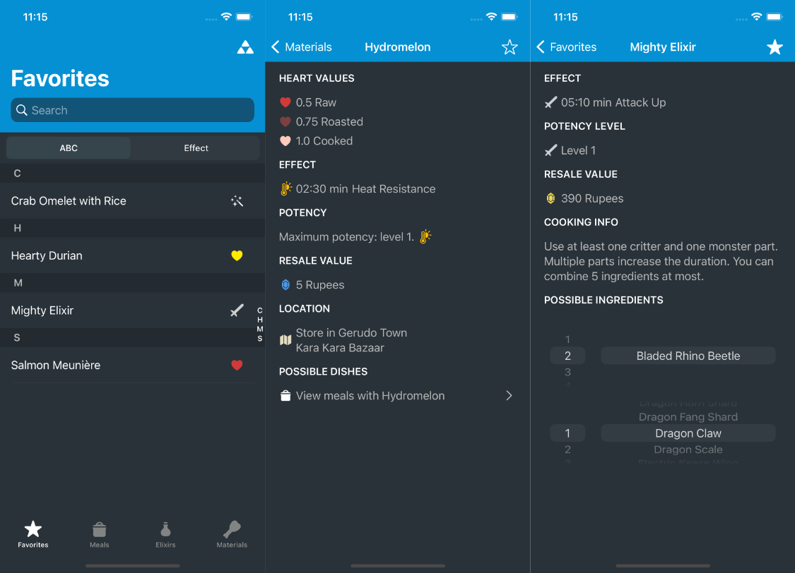

# Recipe Slate

Recipe Slate is an unoffical guide that provides a collection of recipes, elixirs and materials found in Breath of the Wild. You can download Recipe Slate for free on the [App Store](https://apps.apple.com/app/recipe-slate/id1222933628).

## Features

Recipe Slate allows you to

- View materials and recipes of meals and elixirs 📜
- Calculate interactively any effect duration, amount and resale value 🧮
- Sort items by effect category ↕️
- View information about materials 🍖
- Save your favourite elixirs, meals and materials ⭐️

The app supports Dark Mode and has no ads or in-app purchases 🎉

## Notes

- Recipe Slate has been developed 100% in Swift
- Version 1.0 was released on [27th of April in 2017](https://www.reddit.com/r/Breath_of_the_Wild/comments/67tsc5/ios_recipe_slate_10_is_available_on_the_app_store/) and it was my second app on the App Store
- It was rewritten in 2020, but still follows an MVC approach which is not ideal
- Reading [all reviews](https://apps.apple.com/app/recipe-slate/id1222933628?see-all=reviews) warms my heart ❤️